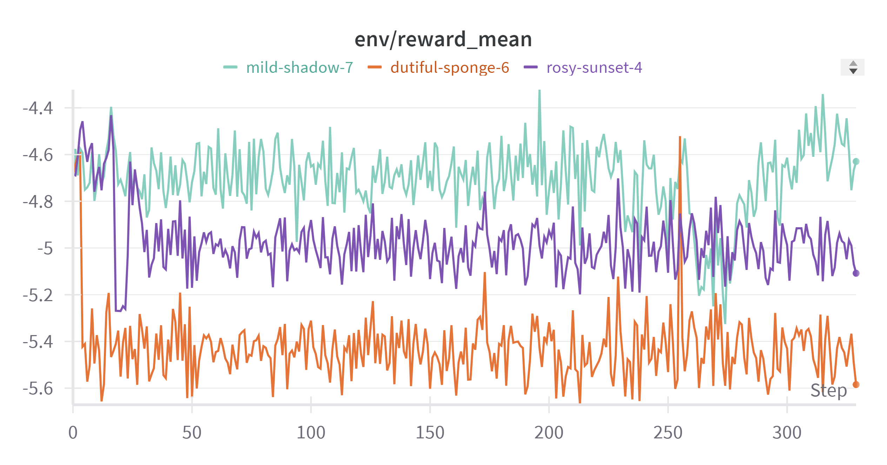

# AI 322 Mini-Project
Repository for the AI 322 mini-project of Rossjyn Fallorina. This repository contains all the necessary code, documentation, and resources for the mini-project.

### Mini-Project Title

Optimizing LLM-assisted Address String Processing with RLHF and Proximal Policy Optimization (PPO)

### Methodology

Address string data was first collected with the assitance of ChatGPT 3.5. Addresses of various establishments were taken, then geocoded via the Geopy library and Nominatim service. The collected data can be found in this [file](documents/addresses_all_processed.csv). Once geolocated, the reversed address strings were obtained to serve as the ideal address string "preferences" to be used when geocoding these locations.

Reinforcement Learning with Human Feedback (RLHF) was then used to fine-tune the responses of a base LLM via Proximal Policy Optimization (PPO). The chosen LLM was OpenAI's GPT2-XL, a 1.6 billion parameter large language model. Three training configuration were designed, each with varying values of learning rates:

| Training Configuration | Fine-tuned Model Name | Learning Rate |
|----------------|----------------|----------------|
| A | Base GPT2-XL-PPO A | 1E-5  |
| B | Base GPT2-XL-PPO B | 1.41E-4  |
| C | Base GPT2-XL-PPO C | 1E-4  |

The reward function was primarily based on the Levenshtein/edit distance between the LLM's responses with the preferred response. The mathematical formulation of the reward function is given by

$$
\text{reward}(x) = 
\begin{cases} 
1 & \text{if } \text{lev}(x,x_{\text{pref}}) = 0 \\ 
-\text{log} \left( \text{lev}(x,x_{\text{pref}}) \right) & \text{otherwise} \\ 
\end{cases}
$$

### Results

The mean rewards during PPO training for all training configurations over all time steps (3 epochs) are plotted below (A is teal; B is purple; C is orange).

The mean rewards of the fine-tuned models are then compared to benchmark [mean] rewards from the base model's responses. The table below summarizes the results:

| Model Name | Mean Reward |
|----------------|----------------|
| Base GPT2-XL | -5.589 |
| Base GPT2-XL-PPO A | -4.629 |
| Base GPT2-XL-PPO B | -5.108 |
| Base GPT2-XL-PPO C | -5.585 |

We find significant improvements in the mean rewards of LLM responses after fine-tuning with PPO, as seen in the table above.
